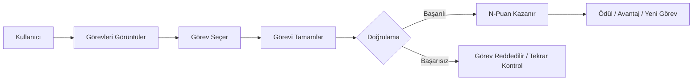
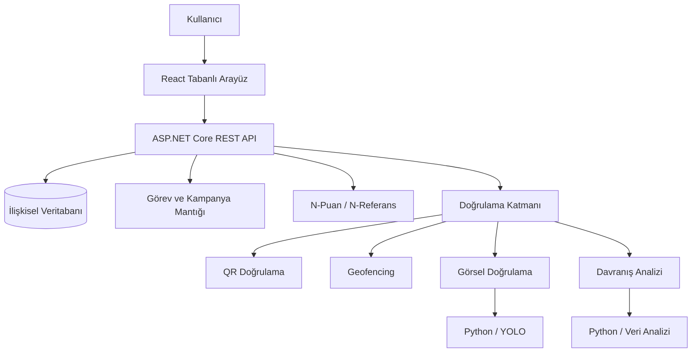

<div align="center">

# N-Taskify

### Dijital ve fiziksel etkileşimleri doğrulanabilir değere dönüştüren oyunlaştırılmış içerik ekonomisi

<p>
  
  
  
</p>

<p>
  
  
  
  
  
  
</p>

**N-Taskify**, N'Sosyal ekosistemiyle bütünleşebilecek şekilde tasarlanan; kullanıcıların dijital ve fiziksel etkileşimlerini görevler üzerinden ölçülebilir ve ödüllendirilebilir değere dönüştürmeyi amaçlayan bir içerik ekonomisi ve dijital sadakat projesidir.

</div>

---

## İçindekiler

- [Proje Hakkında](#proje-hakkında)
- [Problem](#problem)
- [Çözüm](#çözüm)
- [Nasıl Çalışır?](#nasıl-çalışır)
- [Temel Bileşenler](#temel-bileşenler)
- [Öne Çıkan Özellikler](#öne-çıkan-özellikler)
- [Teknik Mimari](#teknik-mimari)
- [Teknoloji Yığını](#teknoloji-yığını)
- [Yapay Zekâ ve Doğrulama](#yapay-zekâ-ve-doğrulama)
- [Kullanıcı Deneyimi](#kullanıcı-deneyimi)
- [Prototip Kapsamı](#prototip-kapsamı)
- [Geliştirme Durumu](#geliştirme-durumu)
- [Detaylı Dokümantasyon](#detaylı-dokümantasyon)

---

## Proje Hakkında

N-Taskify'ın çıkış noktası, sosyal medya ekosisteminde üretilen değerin yalnızca platform ve reklam veren tarafında kalmaması gerektiği düşüncesidir.

Kullanıcılar her gün içerik izliyor, paylaşım yapıyor, etkileşim kuruyor ve platformların büyümesine katkı sağlıyor. İçerik üreticileri yeni gelir kanalları arıyor, markalar ise gerçek kullanıcı davranışını bot veya sahte etkileşimlerden ayırmakta zorlanıyor.

N-Taskify; bu üç tarafı ortak bir **görev, doğrulama ve ödül döngüsü** içerisinde buluşturmayı hedefler.

> Amaç yalnızca “görev yap, puan kazan” mantığında bir uygulama geliştirmek değil; kullanıcı, içerik üreticisi ve marka arasında doğrulanabilir bir değer akışı oluşturmaktır.

---

## Problem

### 👤 Kullanıcı tarafı
Kullanıcılar sosyal platformlarda ciddi zaman geçiriyor ve sürekli etkileşim üretiyor. Buna rağmen oluşturdukları ekonomik değerden doğrudan yararlanabildikleri mekanizmalar sınırlı.

### 🎥 İçerik üreticisi tarafı
İçerik üreticileri çoğunlukla reklam gelirleri, sponsorluklar ve abonelik sistemleri gibi belirli gelir modellerine bağlı kalıyor.

### 🏢 Marka tarafı
Markalar yüksek etkileşime ulaşabilse bile, bu etkileşimin gerçekten kullanıcı tarafından üretildiğini doğrulamak ve fiziksel etkinlik katılımıyla birlikte ölçmek her zaman kolay değil.

---

## Çözüm

N-Taskify, dijital ve fiziksel kullanıcı aksiyonlarını **görev** kavramı üzerinden bir araya getirir.

### Dijital görev örnekleri
- Video izleme
- İçerikle etkileşim kurma
- İçerik paylaşma
- Mini oyun tamamlama

### Fiziksel görev örnekleri
- QR kod okutma
- Belirlenen bir konumda bulunma
- Etkinlik veya stant ziyareti
- Görsel kanıt gönderme

Görev başarıyla tamamlanıp doğrulandığında kullanıcı **N-Puan** kazanır.

---

## Nasıl Çalışır?



---

## Temel Bileşenler

### 🪙 N-Puan
N-Puan, kullanıcıların doğrulanmış görevler sonucunda kazanabildiği platform içi sadakat ve ödül puanıdır.

- Gerçek para değildir.
- Kripto varlık değildir.
- Token altyapısı olarak tasarlanmamıştır.

Planlanan kullanım alanları:
- Ödül kazanımı
- Platform içi avantajlar
- Premium içerik veya özelliklere erişim
- İçerik üreticilerine mikro destek

### 🔗 N-Referans
N-Referans, kullanıcıların ekosisteme sağladığı ağ katkısını ödüllendirmeyi amaçlayan referans mekanizmasıdır.

### 🎯 Hibrit Görev Motoru
Dijital ve fiziksel görevleri aynı sistem içerisinde yönetmeyi hedefleyen çekirdek görev altyapısıdır.

### 🛡️ Çok Katmanlı Doğrulama
Görevin türüne göre QR, geofencing, görsel doğrulama ve davranış analizi gibi farklı yöntemler birlikte kullanılabilir.

---

## Öne Çıkan Özellikler

| Özellik | Açıklama |
|---|---|
| 🎯 **Hibrit görev motoru** | Dijital ve fiziksel görevleri aynı kampanya altyapısında birleştirir. |
| 🪙 **N-Puan sistemi** | Doğrulanmış görevleri platform içi değere dönüştürür. |
| 🔗 **N-Referans** | Kullanıcı kazanımını ve ağ katkısını oyunlaştırır. |
| 📍 **Geofencing** | Konum tabanlı görevlerin doğrulanmasını destekler. |
| 📱 **QR doğrulama** | Fiziksel görevlerde ek doğrulama katmanı sağlar. |
| 👁️ **Görsel doğrulama** | Görev kanıtlarının bilgisayarlı görü ile incelenmesini hedefler. |
| 🧠 **Davranış analizi** | Şüpheli hız, tekrar ve kullanım örüntülerini değerlendirmeyi amaçlar. |
| 🛍️ **Ödül ekosistemi** | N-Puanların çeşitli avantajlarda kullanılmasını hedefler. |

---

## Teknik Mimari

N-Taskify, çok katmanlı ve modüler bir web/mobil sistem olarak planlanmaktadır.



> Diyagram kavramsal mimariyi göstermektedir. Uygulama mimarisi geliştirme sürecinde ihtiyaçlara göre netleştirilecektir.

---

## Teknoloji Yığını

| Katman | Teknoloji |
|---|---|
| **Backend** | C# / ASP.NET Core |
| **API** | REST |
| **Frontend** | React |
| **Veritabanı** | Microsoft SQL Server veya PostgreSQL |
| **Yapay Zekâ / Veri** | Python |
| **Veri İşleme** | NumPy, Pandas, Scikit-learn |
| **Görsel Doğrulama** | YOLO tabanlı hafif modeller |
| **Konum Doğrulama** | Geofencing |
| **Sürüm Kontrolü** | Git / GitHub |

---

## Yapay Zekâ ve Doğrulama

N-Taskify'da yapay zekâ, özellikle **doğrulama, güvenlik ve analiz** ihtiyaçlarını destekleyen bir katman olarak ele alınmaktadır.

### 👁️ Görsel doğrulama
Fiziksel görevlerde gönderilen görsel kanıtların değerlendirilmesi için YOLO tabanlı hafif bilgisayarlı görü modellerinden yararlanılması planlanmaktadır.

### 📍 Konum doğrulama
Konuma bağlı görevlerde cihaz koordinatı, tanımlı geofence yarıçapı, zaman damgası ve görev bağlamı birlikte değerlendirilebilir.

### 🧠 Davranış analizi
- Gerçekçi olmayan görev tamamlama süreleri
- Kısa sürede aşırı görev tamamlama
- Tekrarlayan şüpheli hareketler
- Konum ve görev arasında tutarsızlık
- Bot veya otomasyon ihtimali

### 📊 Model değerlendirme
- Precision
- Recall
- F1-score
- mAP
- False Positive Rate
- ROC-AUC

Henüz ölçülmemiş sonuçlar başarı olarak sunulmayacaktır.

---

## Kullanıcı Deneyimi

Öncelikli tasarım ilkeleri:

- Kısa kullanıcı akışları
- Mobil öncelikli kullanım
- Anlık görev tamamlama geri bildirimi
- N-Puan kazanımının açık biçimde gösterilmesi
- Yüksek renk kontrastı
- Okunabilir tipografi
- Uygun dokunma hedefleri
- Fiziksel görevlerde gereksiz adımlardan kaçınma

Erişilebilirlik tarafında WCAG ilkeleri referans alınmaktadır.

---

## Prototip Kapsamı

İlk çalışan prototipte aşağıdaki temel akışın uçtan uca gösterilmesi hedeflenmektedir:

```text
Kayıt / Giriş
      ↓
Görevleri Görüntüleme
      ↓
Görev Seçme
      ↓
Görevi Tamamlama
      ↓
Doğrulama
      ↓
N-Puan Kazanma
      ↓
Bakiyeyi Görüntüleme
      ↓
Ödül veya Yeni Görev
```

### Hedeflenen modüller
- Kullanıcı yönetimi
- Kimlik doğrulama ve yetkilendirme
- Görev yönetimi
- Kampanya yönetimi
- N-Puan hareketleri
- N-Referans sistemi
- QR doğrulama
- Geofencing
- Görsel doğrulama
- Temel davranış analizi
- Ödül / mağaza akışı
- Yönetim paneli

### İlk prototipte kapsam dışı
- Gerçek para transferleri
- Ödeme kuruluşu entegrasyonları
- Kripto para / token altyapısı
- Geniş ölçekli reklam ihale sistemleri

---

## Geliştirme Durumu

- [x] Proje kapsamının dokümante edilmesi
- [x] Repository ve temel dokümantasyonun hazırlanması
- [x] Proje yapısının oluşturulması
- [x] Temel domain modellerinin hazırlanması
- [ ] Veritabanı altyapısının kurulması
- [ ] Görev yönetiminin geliştirilmesi
- [ ] N-Puan sisteminin geliştirilmesi
- [ ] Kimlik doğrulama ve yetkilendirme
- [ ] N-Referans sisteminin geliştirilmesi
- [ ] Temel kullanıcı arayüzünün hazırlanması
- [ ] QR doğrulama
- [ ] Geofencing
- [ ] Görsel doğrulama
- [ ] Davranış analizi
- [ ] Fonksiyonel testler
- [ ] Kullanılabilirlik ve UX iyileştirmeleri
- [ ] Final demo akışının hazırlanması

---

## Detaylı Dokümantasyon

Projenin kapsamı, mimari yaklaşımı, doğrulama yöntemleri, yapay zekâ bileşenleri, iş modeli ve geliştirme planı hakkında ayrıntılı bilgi için:

### 📘 [N-Taskify Proje Dokümanı](./N-Taskify_PROJECT.md)

---

## Yarışma

**TEKNOFEST 2026 — N'Sosyal İnovasyon Yarışması**  
**Tematik Alan:** İçerik Ekonomisi

---

<div align="center">

### N-Taskify

**Görev. Doğrulama. Değer.**

<sub>Bu repository, projenin aktif geliştirme sürecini ve teknik ilerleyişini takip etmek amacıyla kullanılmaktadır.</sub>

</div>
